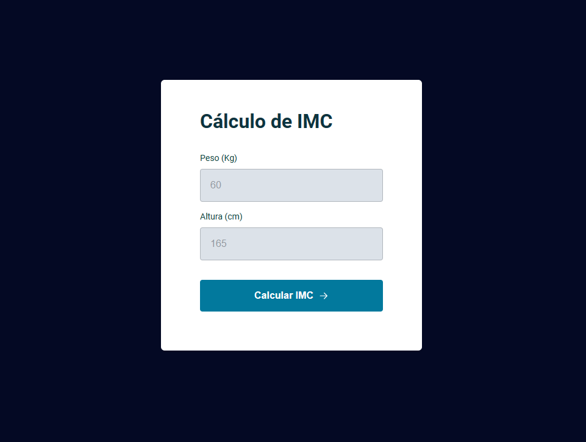

# Calculadora de IMC

  

## 🖥️ Projeto

Projeto construído no Stage 5(Avançando no JavaScript).

Neste projeto foi desenvolvido a criação de um modal pop-up informando o resultado do calculo do IMC. Foi desenvolvido também um alerta de erro para quando o usuário digite um valor diferente do solicitado.

## 🚀 Tecnologias

Esse projeto foi desenvolvido durante a trilha Explorer da Rocketseat com as seguintes tecnologias:

- HTML
- CSS
- JavaScript
- Figma

## 🏷️ Layout

Você pode visualizar o layout do projeto através [desse link](<https://www.figma.com/file/ZJfu97EHIsKjOS6pLqGAM7/IMC-(Copy)?type=design&node-id=6-4&mode=design&t=4fiyQbXOvNOWEKo5-0>).  
É necessário ter uma conta no [Figma](https://www.figma.com)  
Deploy do projeto [Calculadora IMC](<https://calculandoimc.vercel.app/>)
